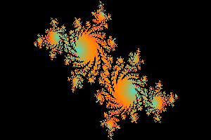

<h1 align="center"> Mandelbrot / Julia Set Fractal Generator </h1>

<p align="center">
   
   
</p>

<p align="center">
  <b >A tool for generating Mandelbrot and Julia set fractal images.</b>
</p>

<hr>


## Installation

```
  npm install @hiteshlala/mandelbrot-julia
```


## Usage


The simplest case: 

```
  const { createConfigs, Julia, Mandelbrot } = require( '@hiteshlala/mandelbrot-julia' );

  async function draw() {
    try {
      console.log( '\nGenerate Julia' )
      const jconf = createConfigs( './julia.jpg' );
      const julia = new Julia( jconf );
      await julia.create();

      console.log( '\nGenerate Mandelbrot')
      const mconf = createConfigs( './mandel.jpg' );
      const mandel = new Mandelbrot( mconf );
      await mandel.create();

      console.log( '\nDone' )

    }
    catch( e ) {
      console.log( e.message || e );
    }
  }

  draw();

```

This generates julia.jpg and mandel.jpg in the current working folder using default values.


## Customize

Adjusting the view window:

```
  const mconf = createConfigs( './mandel.jpg' );

  mconf.minX = -2.1;
  mconf.maxX = 0.5;
  mconf.minY = -1;
  mconf.maxY = 1;

  const mandel = new Mandelbrot( mconf );
  await mandel.create();
```


Adjusting the image resolution:

```
  const mconf = createConfigs( './mandel.jpg' );

  mconf.width = 300;
  mconf.height = 200;

  const mandel = new Mandelbrot( mconf );
  await mandel.create();
```


Adjusting the number of iterations:

```
  const mconf = createConfigs( './mandel.jpg' );

  mconf.iterations = 300;

  const mandel = new Mandelbrot( mconf );
  await mandel.create();
```


Change the Z constant for Julia:

```
  const mconf = createConfigs( './mandel.jpg' );

  mconf.c = { r: 0.1, i: -0.5 };

  const mandel = new Mandelbrot( mconf );
  await mandel.create();
```


Create a different color pallete:

```
  const { generateColors, createConfigs, Mandelbrot } = require( '@hiteshlala/mandelbrot-julia' );

  // uses tinygradient package to create a continuous gradient of colors
  const colors = generateColors(
    // array of colors to traverse in gradient
    [ 
      { r: 64, g: 224, b: 208 },
      { r: 255, g: 140, b: 0 },
      { r: 255, g: 0, b: 128},
      { r: 0, g: 0, b: 0 }
    ], 
    // number of steps to have in gradient
    50   
  );

  const mconf = createConfigs( './mandel.jpg' );

  mconf.colors = colors;

  const mandel = new Mandelbrot( mconf );
  await mandel.create();
```


The Mandelbrot image at the top of the page was created using a default config adjusted to:

```
  mconf.minX = -2.1;
  mconf.maxX = 0.5;
  mconf.minY = -1;
  mconf.maxY = 1;
  mconf.width = 300;
  mconf.height = 200;
```


